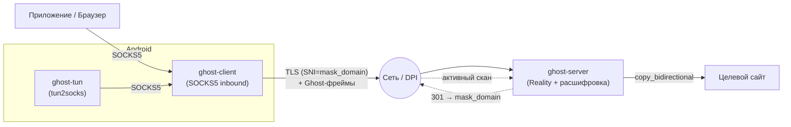

<div align="center">

# 👻 Reliz Protocol (Ghost)

**Stealth-прокси на чистом Rust: кастомный шифрованный транспорт, Reality-маскировка под TLS, анти-DPI и мобильный VPN-клиент.**

[](https://www.rust-lang.org/)
[](LICENSE)
[]()
[]()

</div>

---

> ⚠️ **Дисклеймер:** Это исследовательский проект, написанный для изучения устройства современных stealth-протоколов (VLESS / Reality / XTLS) и техник обхода DPI. Используйте на свой риск. Текущая версия — рабочий прототип, **не прошедший аудит безопасности** (см. раздел [Известные ограничения](#известные-ограничения)).

## Что это

Reliz Protocol (кодовое имя **Ghost**) — собственная реализация stealth-туннеля, вдохновлённая идеями `VLESS + Reality + XTLS-Vision` из экосистемы Xray, но написанная с нуля на Rust. Задача проекта — создать прозрачный прокси, трафик которого для внешнего наблюдателя (DPI / активные сканеры цензора) неотличим от обычной HTTPS-сессии к легальному сайту.

Проект включает полный стек: серверный демон, клиент с локальным SOCKS5, криптослой, Reality-маскировку и мобильное Android-приложение на Flutter с userspace `tun2socks`.

## Ключевые фичи

- **Reality-маскировка:** TLS-обёртка с подменой SNI под легальный домен (например, `www.apple.com`). При стороннем сканировании сервер прикидывается реальным сайтом и отдаёт валидный HTTP-редирект, а настоящий клиент аутентифицируется скрытым токеном в TLS-хендшейке.
- **Анти-DPI инструменты:**
  - *Dynamic Padding* — добавление случайного мусора к фреймам для маскировки сигнатур по размеру пакетов.
  - *TCP Fragmentation* (в стиле ByeDPI) — дробление TLS ClientHello на мелкие TCP-сегменты, ломающее сборку сигнатур на стороне DPI.
- **JA4-профили:** Встроенные отпечатки Chrome 131 и Firefox 133 + парсер JA4 для анализа входящих ClientHello на сервере.
- **Шифрование:** AEAD на базе ChaCha20-Poly1305 с деривацией ключей через HKDF-SHA256 (на основе User ID и pre-shared secret).
- **Android-клиент:** Flutter UI + интеграция с Rust через `flutter_rust_bridge`. Использует системный `VpnService` и собственный модуль `ghost-tun`.

## Структура проекта (монорепозиторий)

| Крейт | Назначение |
|---|---|
| `ghost-common` | Типы протокола, фрейминг (`GhostFrame`), адресация и стелс-примитивы (padding, фрагментация) |
| `ghost-crypto` | Обёртка над ChaCha20-Poly1305 (`GhostCipher`) и HKDF |
| `ghost-reality` | Логика Reality-сервера, TLS-инкапсуляция и валидация JA4-fingerprints |
| `ghost-tun` | Userspace-реализация `tun2socks` (TUN fd → парсинг IP/TCP → SOCKS5) для мобильного VPN |
| `ghost-client` | SOCKS5-инбаунд (исполняемый файл) |
| `ghost-server` | Серверный демон (исполняемый файл) |
| `ghost_flutter` | Исходники Android-приложения |



## Формат протокола

### Структура фрейма (до шифрования)

```
+---------+-----------+-----------------+-------------+-----------+--------------+----------+
| Ver(1B) | UserID(16)| AddrType + Addr | PayloadLen  | Payload   | PaddingLen   | Padding  |
|         |           |  (var)          |   (2B BE)   |  (var)    |    (1B)      |  (var)   |
+---------+-----------+-----------------+-------------+-----------+--------------+----------+
```

`AddrType`: `0x01` IPv4 · `0x03` Domain · `0x04` IPv6 · `0x00` None (data-only фрейм, адрес уже известен серверу).

После init-фрейма адрес не дублируется — последующие пакеты в сессии несут только payload.

### На проводе (зашифрованный фрейм)

```
[ FrameLen : 2B BE ][ Nonce : 12B ][ Ciphertext + Tag : N+16B ]
```

### Этапы соединения

1. Клиент инициирует TCP-соединение и выполняет TLS-хендшейк с `SNI = mask_domain`.
2. Внутри TLS-сессии клиент передаёт auth-токен. Если проверка провалена (пришёл сканер цензора), сервер прикидывается обычным веб-сервером и отдаёт `301 Redirect` на `mask_domain`.
3. При успешной авторизации клиент отправляет UserID и зашифрованный init-фрейм с целевым адресом.
4. Устанавливается двунаправленный обмен (`copy_bidirectional`).

## Сборка и запуск

Для сборки требуется Rust (stable, 2021 edition).

```bash
# Компиляция воркспейса в релиз
cargo build --release

# Запуск тестов
cargo test
```

### Быстрый старт — сервер

```bash
sudo cp target/release/ghost-server /usr/local/bin/
sudo cp deploy/ghost.sh /usr/local/bin/ghost && sudo chmod +x /usr/local/bin/ghost

sudo ghost setup     # Интерактивная настройка, генерация UUID и systemd-юнита
sudo ghost status    # Проверка статуса и чтение логов
sudo ghost key       # Сгенерировать новый UUID для клиента
```

Пример конфига (`/etc/ghost/ghost-server.conf`):

```toml
listen_addr      = "0.0.0.0:443"
allowed_users    = ["00000000000000000000000000000001"]
enable_padding   = true
max_padding_len  = 64
enable_reality   = true
mask_domain      = "www.apple.com"
reality_auth_key = "<32_bytes_hex_key>"
verify_ja4       = false
allowed_ja4      = []
```

### Запуск клиента

Клиент по умолчанию поднимает локальный SOCKS5 на `127.0.0.1:10808`.

```toml
socks5_listen        = "127.0.0.1:10808"
server_addr          = "your-server:443"
user_id              = "00000000000000000000000000000001"
enable_padding       = true
enable_fragmentation = false
max_padding_len      = 64
mask_domain          = "www.apple.com"   # "none" для отключения TLS
reality_auth_key     = "<тот же ключ, что на сервере>"
```

## Известные ограничения

Текущий статус проекта — рабочий прототип; есть ряд компромиссов:

- **Упрощённый auth-токен:** Авторизация использует статический `hex(auth_key)`, что теоретически уязвимо к replay-атакам. В планах — переход на динамический HMAC (timestamp + client_random).
- **Хардкод секретов:** Pre-shared secret для генерации ключей (`ghost_default_key!`) пока зашит в код; нужно выносить в конфиг.
- **Частичный JA4-spoofing:** Сервер умеет валидировать отпечатки, но сам клиент полагается на стандартный `rustls`, из-за чего реальный ClientHello пока не на 100% совпадает с оригинальным Chrome.
- **Только TCP:** В модуле `ghost-tun` (tun2socks) на данный момент отсутствует обработка UDP (нет реализации UDP-ASSOCIATE).

## Лицензия

Проект распространяется под лицензией MIT — см. [LICENSE](LICENSE).