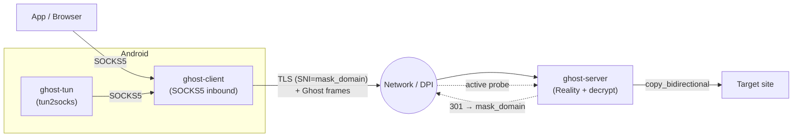

<div align="center">

# 👻 Reliz Protocol (Ghost)

**A stealth proxy in pure Rust: custom encrypted transport, Reality TLS masquerading, anti-DPI tooling, and a mobile VPN client.**

[](https://www.rust-lang.org/)
[](LICENSE)
[]()
[]()

</div>

---

> ⚠️ **Disclaimer:** This is a research project written to explore the internals of modern stealth protocols (VLESS / Reality / XTLS) and DPI-bypass techniques. Use at your own risk. The current version is a working prototype that **has not undergone a security audit** (see [Known Limitations](#known-limitations)).

## What is this

Reliz Protocol (codename **Ghost**) is a custom stealth tunnel implementation inspired by `VLESS + Reality + XTLS-Vision` from the Xray ecosystem, written from scratch in Rust. The goal is to build a transparent proxy whose traffic is indistinguishable from a regular HTTPS session to a legitimate website for any external observer (DPI / active censorship scanners).

The project includes a full stack: a server daemon, a client with a local SOCKS5 inbound, a crypto layer, Reality masquerading, and an Android mobile app built with Flutter and userspace `tun2socks`.

## Key Features

- **Reality masquerading:** TLS wrapper with SNI spoofed to a legitimate domain (e.g. `www.apple.com`). When probed by an external scanner, the server impersonates a real website and returns a valid HTTP redirect; a genuine client authenticates via a hidden token embedded in the TLS handshake.
- **Anti-DPI tooling:**
  - *Dynamic Padding* — appends random noise to frames to obscure packet-size fingerprints.
  - *TCP Fragmentation* (ByeDPI-style) — splits the TLS ClientHello into small TCP segments, breaking DPI signature reassembly.
- **JA4 profiles:** Built-in Chrome 131 and Firefox 133 fingerprints, plus a JA4 parser for validating incoming ClientHello on the server side.
- **Encryption:** AEAD via ChaCha20-Poly1305 with key derivation through HKDF-SHA256 (based on User ID and a pre-shared secret).
- **Android client:** Flutter UI + Rust integration via `flutter_rust_bridge`. Uses the system `VpnService` and the custom `ghost-tun` module.

## Project Structure (monorepo)

| Crate | Purpose |
|---|---|
| `ghost-common` | Protocol types, framing (`GhostFrame`), addressing, and stealth primitives (padding, fragmentation) |
| `ghost-crypto` | ChaCha20-Poly1305 wrapper (`GhostCipher`) and HKDF |
| `ghost-reality` | Reality server logic, TLS encapsulation, and JA4 fingerprint validation |
| `ghost-tun` | Userspace `tun2socks` (TUN fd → IP/TCP parsing → SOCKS5) for the mobile VPN |
| `ghost-client` | SOCKS5 inbound (binary) |
| `ghost-server` | Server daemon (binary) |
| `ghost_flutter` | Android app source |



## Protocol Format

### Frame structure (plaintext)

```
+---------+-----------+-----------------+-------------+-----------+--------------+----------+
| Ver(1B) | UserID(16)| AddrType + Addr | PayloadLen  | Payload   | PaddingLen   | Padding  |
|         |           |  (var)          |   (2B BE)   |  (var)    |    (1B)      |  (var)   |
+---------+-----------+-----------------+-------------+-----------+--------------+----------+
```

`AddrType`: `0x01` IPv4 · `0x03` Domain · `0x04` IPv6 · `0x00` None (data-only frame; address is already known to the server).

After the init frame, the address is not repeated — subsequent packets in a session carry only the payload.

### On the wire (encrypted frame)

```
[ FrameLen : 2B BE ][ Nonce : 12B ][ Ciphertext + Tag : N+16B ]
```

### Connection flow

1. The client establishes a TCP connection and performs a TLS handshake with `SNI = mask_domain`.
2. Inside the TLS session, the client sends an auth token. If validation fails (e.g. a censorship scanner), the server falls back to behaving like a normal web server and returns a `301 Redirect` to `mask_domain`.
3. On successful authentication, the client sends the UserID and an encrypted init frame containing the target address.
4. Bidirectional data exchange begins (`copy_bidirectional`).

## Build & Run

Requires Rust (stable, 2021 edition).

```bash
# Build the workspace in release mode
cargo build --release

# Run tests
cargo test
```

### Quick start — server

```bash
sudo cp target/release/ghost-server /usr/local/bin/
sudo cp deploy/ghost.sh /usr/local/bin/ghost && sudo chmod +x /usr/local/bin/ghost

sudo ghost setup     # Interactive setup: generates a UUID and a systemd unit
sudo ghost status    # Check status and read logs
sudo ghost key       # Generate a new UUID for a client
```

Example config (`/etc/ghost/ghost-server.conf`):

```toml
listen_addr      = "0.0.0.0:443"
allowed_users    = ["00000000000000000000000000000001"]
enable_padding   = true
max_padding_len  = 64
enable_reality   = true
mask_domain      = "www.apple.com"
reality_auth_key = "<32_bytes_hex_key>"
verify_ja4       = false
allowed_ja4      = []
```

### Running the client

The client listens for SOCKS5 connections on `127.0.0.1:10808` by default.

```toml
socks5_listen        = "127.0.0.1:10808"
server_addr          = "your-server:443"
user_id              = "00000000000000000000000000000001"
enable_padding       = true
enable_fragmentation = false
max_padding_len      = 64
mask_domain          = "www.apple.com"   # set to "none" to disable TLS
reality_auth_key     = "<same key as on the server>"
```

## Known Limitations

The project is a working prototype; some trade-offs remain:

- **Simplified auth token:** Authentication currently uses a static `hex(auth_key)`, which is theoretically vulnerable to replay attacks. The plan is to move to a dynamic HMAC (timestamp + client_random).
- **Hardcoded secret:** The pre-shared secret used for key derivation (`ghost_default_key!`) is currently baked into the code and needs to be moved to config.
- **Partial JA4 spoofing:** The server can validate fingerprints, but the client relies on stock `rustls`, so the actual ClientHello does not yet fully match a real Chrome fingerprint.
- **TCP only:** The `ghost-tun` module (tun2socks) currently has no UDP support (UDP-ASSOCIATE is not implemented).

## License

MIT — see [LICENSE](LICENSE).
